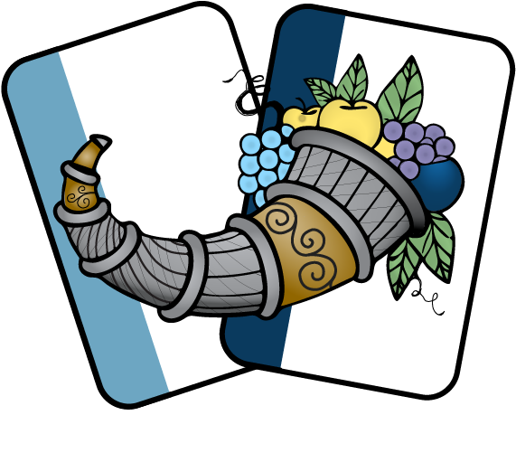

{ align=right width=180 }

OWASP Cornucopia is a card game used to help derive application security requirements
during the software development life cycle.
[Cornucopia][cornucopia] is an OWASP Lab project, and can be [downloaded][cornucopia-cards] from its project page.

#### What is Cornucopia?

Cornucopia provides a [set of cards][cornucopia-cards] designed to gamify threat modeling activities,
helping agile development teams to identify weaknesses in applications and then record remediations or requirements.

There are three versions of the Cornucopia deck of threat modeling cards:

* Website App Edition
* Mobile App Edition
* Enterprise App Edition

The decks come with several suits according to the application, and always contain an overall 'Cornucopia' suit.

Cornucopia can be played in many different ways, there is no one way,
and there is a suggested [set of rules][cornucopia-play] to start the game off.
Cornucopia provides a [score sheet][cornucopia-score] to can help keep track of the game session and to record outcomes.

#### Website App Edition

Each card in the Website App deck describes a common error or anti-pattern that allows systems to be vulnerable to attack.
Vulnerabilities are arranged in domains as five suits with the additional Cornucopia suit ranging across these domains:

* Data Validation and Encoding
* Authentication
* Session Management
* Authorization
* Cryptography
* Cornucopia

To provide context the Cornucopia Website App cards reference other projects:

* OWASP Application Security Verification Standard ([ASVS][asvs])
* OWASP Secure Coding Practices ([SCP][scp-v21]]) quick reference guide
* OWASP [AppSensor][appsensor]
* MITRE's Common Attack Pattern Enumeration and Classification ([CAPEC][capec])
* [SAFEcode][safecode]

The SCP quick reference guide has now been incorporated as part of this [Developer Guide](../02-web-app-checklist/index.md).

#### Mobile App Edition

Similarly to the website application deck, the mobile application deck has five domains/suits,
with Cornucopia cross domain:

* Platform and Code
* Authentication and Authorization
* Network and Storage
* Resilience
* Cryptography
* Cornucopia

For context the Cornucopia Mobile App cards reference these other projects:

* OWASP Mobile Application Security Verification Standard ([MASVS][masvs])
* OWASP Mobile Application Security Testing Guide ([MASTG][mastg])
* MITRE's Common Attack Pattern Enumeration and Classification ([CAPEC][capec])
* [SAFEcode][safecode]

#### Ecommerce Website Edition

This is the original Cornucopia deck and has the same domains/suits, including the Cornucopia cross domain suit,
as the Website App Edition. Some of the vulnerabilities are specific to Ecommerce,
but it references the same projects as the website edition.

#### Why use it?

Cornucopia is useful for both requirements analysis and threat modeling,
providing gamification of these activities within the development lifecycle.
It is targeted towards agile development teams and provides a different perspective to these tasks.

The outcome of the game is to identify possible threats and propose remediations.

#### How to use Cornucopia

The OWASP Spotlight series provides an excellent overview of Cornucopia and how it can be used for gamification:
'Project 16 - [Cornucopia][spotlight16]'.

Ideally Cornucopia is played in person using physical cards,
with the development team and security architects in the same room.
The application should already have been described by an architecture diagram or data flow diagram
so that the players have something to refer to during the game.

The suggested order of play is:

1. Pre-sort: the deck, some cards may not be relevant for the web application
2. Deal: the cards equally to the players
3. Play: the players take turns to select a card
4. Describe: the player describes the possible attack using the card played
5. Convince: the other players have to be convinced that the attack is valid
6. Score: award points for a successful attack
7. Follow suit: the next player has to select a card from the same suit
8. Winner: the player with the most points
9. Follow up: each valid threat should be recorded and acted upon

Remember that the outcome of the game is to identify possible threats and propose remediations,
as well as having a good time.

#### References

* [AppSensor][appsensor]
* Application Security Verification Standard, [ASVS][asvs]
* Common Attack Pattern Enumeration and Classification, [CAPEC][capec]
* [Cornucopia][cornucopia]
* Mobile Application Security Verification Standard, [MASVS][masvs])
* Mobile Application Security Testing Guide, [MASTG][mastg])
* [Secure Coding Practices][scp-v21] quick reference guide
* [SAFEcode][safecode]
* [Spotlight][spotlight16] on Cornucopia

----

The OWASP Developer Guide is a community effort; if there is something that needs changing
then [submit an issue][issue060104] or [edit on GitHub][edit060104].

[appsensor]: https://owasp.org/www-project-appsensor/
[asvs]: https://owasp.org/www-project-application-security-verification-standard/
[capec]: https://capec.mitre.org/
[cornucopia]: https://owasp.org/www-project-cornucopia/
[cornucopia-cards]: https://owasp.org/www-project-cornucopia#div-cards
[cornucopia-score]: https://owasp.org/www-project-cornucopia/assets/files/Cornucopia-scoresheet.pdf
[cornucopia-play]: https://owasp.org/www-project-cornucopia#div-play
[edit060104]: https://github.com/OWASP/DevGuide/blob/main/docs/04-design/01-threat-modeling/04-cornucopia.md
[issue060104]: https://github.com/OWASP/DevGuide/issues/new?labels=content&template=request.md&title=Update:%2004-design/01-threat-modeling/04-cornucopia
[mastg]: https://mas.owasp.org/MASTG/
[masvs]: https://mas.owasp.org/MASVS/
[safecode]: https://safecode.org/
[scp-v21]: https://owasp.org/www-project-secure-coding-practices-quick-reference-guide/assets/docs/OWASP_SCP_Quick_Reference_Guide_v21.pdf
[spotlight16]: https://youtu.be/NesxjEGX58s
